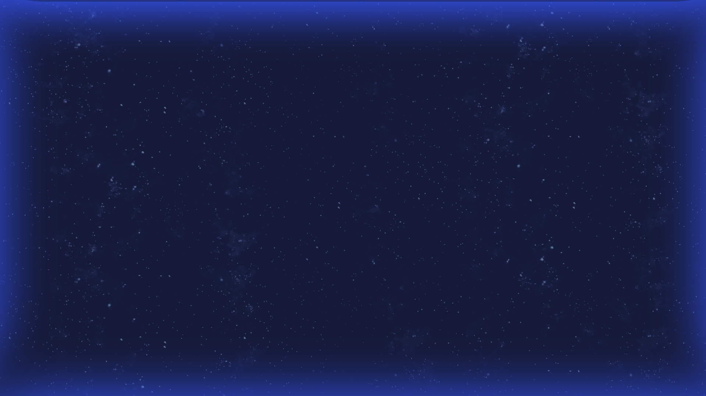

CLOUD 101 - UI/UX Design System
"Learn. Connect. Bingo!"

1. Design Vision
COULD 101 is a gamified networking platform with a cosmic, space-themed aesthetic. The design emphasizes connection, exploration, and engagement through an intuitive bingo grid interface. The visual language combines deep space blues with vibrant accent colors to create an immersive, modern experience.

Visual Inspiration: Cosmic navigation through stars, representing networking connections

2. Color Palette

Primary Colors:
• Space Navy (Background): #0A0E27 - Deep cosmic blue for primary background
• Cosmic Blue: #1E3A8A - Rich blue for cards and containers
• Stellar Purple: #7C3AED - Accent color for interactive elements
• Nebula Gradient: Linear gradient from #1E3A8A to #7C3AED

Secondary Colors:
• Star White: #FFFFFF - Primary text and icons
• Moon Gray: #9CA3AF - Secondary text and borders
• Success Green: #10B981 - For completed bingo slots and success states
• Warning Amber: #F59E0B - For alerts and attention

Background Effects:
• Starfield particle effect with subtle parallax
• Gradient overlays from deep navy to lighter cosmic blue
• Glassmorphism effects on cards (backdrop-blur + semi-transparent backgrounds)

3. Typography

Font Family: Inter (primary), system-ui fallback

Heading Scale:
• H1 (Page Title): 36px / 2.25rem, font-weight: 700, letter-spacing: -0.02em
• H2 (Section): 24px / 1.5rem, font-weight: 600, letter-spacing: -0.01em
• H3 (Card Title): 18px / 1.125rem, font-weight: 600

Body Text:
• Large: 16px / 1rem, font-weight: 400, line-height: 1.6
• Regular: 14px / 0.875rem, font-weight: 400, line-height: 1.5
• Small: 12px / 0.75rem, font-weight: 400, line-height: 1.4

Special:
• Button Text: 14px, font-weight: 600, uppercase
• Caption: 12px, font-weight: 500, color: Moon Gray

4. Component Library & Design Specifications

4.1 PROFILE SETUP SCREEN
Layout:
• Centered card container with max-width: 500px
• Gradient background from #0A0E27 to #1E3A8A with animated starfield
• Card with glassmorphism effect (backdrop-blur: 10px, bg-opacity: 0.8)

Components:
• Avatar Circle: 80x80px, shows initials or preview image
• Input Fields: Full width, padding 12px 16px, rounded-lg, border: 1px solid #7C3AED
• Character Counter: Position bottom-right of name field, small font, Moon Gray color
• URL Validator: Green checkmark icon appears on valid input
• Image Preview: 120x120px square with rounded-lg, centered below URL input
• Primary Button: Background Stellar Purple, hover: brightness 110%, width: full, height: 48px, rounded-lg

Animations:
• Fade-in on mount: 0.5s ease-out
• Button hover: scale 1.02, shadow expansion
• Input focus: border color to #10B981, glow effect

Errors:
• Error text: 12px, color: #EF4444, margin-top: 4px
• Field shake animation on validation error: duration 0.4s
• Red border on field with error state

4.2 BINGO GRID SCREEN
Layout:
• Full viewport background: Space Navy with starfield animation
• Content container: max-width: 1200px, centered, padding: 24px
• Top banner with progress indicator
• Grid area: 5x5 CSS Grid with gap: 12px
• Mobile: 4x4 grid with responsive gaps
• Tablet: 5x5 grid optimized for touch

Grid Slots:
• Empty Slot: 80x80px (mobile), 100x100px (desktop)
• Container: dashed border (2px, #7C3AED), rounded-full
• Icon: "+" centered, size 32px, color: #7C3AED
• Filled Slot: Avatar image, rounded-full, border: 2px solid #10B981
• Loaded Animation: Scale from 0.5 to 1 over 0.3s, bounce effect
• Hover State: Ring effect (4px ring, color: #7C3AED), shadow expansion
• Click Handler: Opens modal for empty, shows user card for filled

Progress Banner:
• Position: Sticky top, padding: 16px 24px
• Background: Transparent with backdrop-blur
• Text: "X more connections to complete BINGO!"
• Progress Bar: Height 4px, background gradient, animated fill
• Count Display: Large font (20px), Stellar Purple color

4.3 CHALLENGE MODAL
Structure:
• Overlay: Dark backdrop (rgba(0,0,0,0.7)), blur effect
• Modal Container: Centered, max-width: 600px, rounded-xl
• Background: Cosmic Blue with gradient, glassmorphism effect
• Padding: 32px (desktop), 24px (mobile)

Content:
• Header: H2 size, "Connect with..." text
• Challenge Icon: Large emoji (48px), centered
• Challenge Title: H3 size, centered, color: Star White
• Description: Regular body text, color: Moon Gray, line-height: 1.6
• Category Badge: Inline pill with category color, small font
• Input Field: QR code scanner or manual 6-digit code entry
• Button Group: Two buttons - Cancel (transparent) and Confirm (Stellar Purple)

Animations:
• Modal entrance: Scale 0.8 to 1 over 0.3s, fade-in
• Modal exit: Scale and fade-out, 0.2s
• Input shake on invalid code

Validation:
• Valid code: Checkmark animation, success color flash
• Invalid code: Error message, field shake, red highlight

5. Responsive Design Breakpoints

Mobile (320px - 640px):
• Single-column layout
• Full-width components with 16px padding
• Bingo grid: 4x4 slots, 60px size
• Cards: Full width with 16px padding
• Font sizes: Scale down by 10-15%
• Modals: Full width, bottom-sheet style on small screens

Tablet (641px - 1024px):
• Two-column layout where applicable
• Bingo grid: 5x5 slots, 80px size
• Cards: Max-width 500px, centered
• Standard padding: 20px
• Touch-friendly spacing: min 44x44px for interactive elements

Desktop (1025px+):
• Multi-column layouts fully utilized
• Bingo grid: 5x5 slots, 100px size
• Max-width: 1200px for content containers
• Standard padding: 24px-32px
• Hover effects and transitions enabled

6. Spacing & Sizing System

Spacing Scale (based on 4px unit):
• xs: 4px
• sm: 8px
• md: 12px
• lg: 16px
• xl: 24px
• 2xl: 32px
• 3xl: 48px

Component Sizing:
• Icon sizes: 16px, 20px, 24px, 32px, 48px, 64px
• Button heights: 32px (small), 40px (medium), 48px (large)
• Input field height: 40px
• Card radius: 8px (small), 12px (medium), 16px (large)
• Avatar: 40px, 56px, 80px, 120px circular

7. Button Styles & States

Primary Button (CTA)
• Background: Stellar Purple (#7C3AED)
• Text: Star White, uppercase, font-weight: 600
• Padding: 12px 24px
• Border-radius: 8px
• Hover: brightness(1.1), box-shadow: 0 8px 16px rgba(124, 58, 237, 0.3)
• Active: brightness(0.95), scale(0.98)
• Disabled: opacity(0.6), cursor: not-allowed
• Transitions: all 0.2s ease

Secondary Button
• Background: transparent
• Border: 1px solid Moon Gray
• Text: Moon Gray, font-weight: 500
• Hover: border-color: Stellar Purple, text-color: Stellar Purple
• Active: background: rgba(124, 58, 237, 0.1)

Dangerous/Error Button
• Background: #EF4444 (red)
• Text: Star White
• Hover: brightness(1.1)
• Uses same sizing as Primary

Icon Button
• Background: transparent
• Size: 40x40px, centered content
• Icon size: 20px or 24px
• Hover: background: rgba(124, 58, 237, 0.1), rounded
• Active: background: rgba(124, 58, 237, 0.2)

8. Animation & Motion Guidelines

Page Transitions:
• Entry: Fade-in 0.4s ease-out
• Exit: Fade-out 0.2s ease-in
• Slide: Slide-in from bottom 0.3s cubic-bezier(0.4, 0, 0.2, 1)

Component Animations:
• Button hover: scale(1.02) + shadow expansion, 0.2s ease
• Input focus: Border glow, 0.3s ease
• Modal appears: Scale (0.8 to 1) + fade-in, 0.3s cubic-bezier(0.34, 1.56, 0.64, 1)
• Grid item load: Scale (0.5 to 1) + rotate, 0.4s with stagger

Background Effects:
• Starfield: Continuous gentle float animation, slow speed
• Gradient: Subtle shift every 8s, smooth transitions
• Particles: Floating effect with parallax on scroll

Transition Timing:
• Fast: 0.2s (hover states, quick feedback)
• Normal: 0.3s (most interactions)
• Slow: 0.5s+ (page transitions, entrances)

Easing Functions:
• ease-in-out: cubic-bezier(0.4, 0, 0.2, 1) - standard smooth
• ease-out: cubic-bezier(0.0, 0, 0.2, 1) - snappy entrance
• bounce: cubic-bezier(0.34, 1.56, 0.64, 1) - playful effect

9. Accessibility & Inclusive Design

Contrast & Readability:
• WCAG AA minimum: 4.5:1 contrast for all text
• Large text: 3:1 contrast minimum
• All interactive elements: Minimum 44x44px touch target
• Font sizes never smaller than 12px in regular text

Keyboard Navigation:
• Tab order: Logical flow from top to bottom, left to right
• Focus indicator: Visible ring (3px, Stellar Purple) on all focusable elements
• Focus visible: outline-offset: 2px
• Escape key: Closes modals
• Enter/Space: Activates buttons

Screen Reader Support:
• Semantic HTML: buttons, inputs, labels properly structured
• ARIA labels: All icons and icon buttons have aria-label
• Status updates: Live regions for validation messages
• Link text: Descriptive, avoiding "click here"
• Images: Alt text for all decorative and functional images

Motion & Animations:
• Respect prefers-reduced-motion: Disable animations if user preference set
• Provide pause/play controls for auto-playing content
• No flashing content > 3 Hz

Color Accessibility:
• Don’t rely on color alone to convey information
• Use icons + text + color combinations
• Test designs with color blindness simulators

10. Implementation Notes for Developers

Tailwind CSS Configuration:
• Extend colors in tailwind.config.js:
  - colors: {
      'space-navy': '#0A0E27',
      'cosmic-blue': '#1E3A8A',
      'stellar-purple': '#7C3AED',
      'star-white': '#FFFFFF',
      'moon-gray': '#9CA3AF'
    }
• Extend animation timing
• Add custom gradient stops for nebula effect

Framer Motion Usage:
• Use variants for consistent animation patterns
• whileHover, whileTap for interactive elements
• layoutId for shared layout animations
• AnimatePresence for exit animations

Component Architecture:
• UI components: Reusable, style-agnostic
• Feature components: Page-specific, composed of UI components
• Container/Presenter pattern for complex logic
• Custom hooks for shared state logic

Performance:
• Lazy load components with React.lazy
• Optimize images: WebP with fallbacks
• SVG icons: Inline or sprite sheets
• Debounce search and validation inputs
• Memoize expensive computations with useMemo
• Use React Query for server state

Testing:
• Snapshot tests for component renders
• Unit tests for utility functions
• Integration tests for user workflows
• Accessibility testing with jest-axe
• Visual regression with Percy or Chromatic

11. Design Resources & Tools

Front-End Libraries:
• shadcn/ui - Pre-built accessible components
• Framer Motion - Advanced animations
• React Hot Toast - Toast notifications
• React Hook Form - Form state management
• Zod - Schema validation

Utility Libraries:
• clsx - Conditional CSS classes
• tailwind-merge - Merge Tailwind classes
• date-fns - Date manipulation

Icons & Assets:
• Lucide React - Icon library
• Heroicons - Alternative icon set
• Phosphor Icons - Diverse icon styles

Development Tools:
• Storybook - Component documentation
• Chromatic - Visual regression testing
• Figma - Design and prototyping
• TypeScript - Type safety

Live Preview & Testing:
• Vercel Deploy Preview - Live staging
• Percy.io - Visual testing
• Axe DevTools - Accessibility audits

Design Inspiration:
• Reference Image: Cosmic starfield background with deep navy gradients
• Design Direction: Modern, futuristic, gaming-inspired, accessible
• Mood: Playful yet professional, engaging yet clean

---

Design Document Version: 1.0
Last Updated: 2026-02-08
Status: Ready for Development

For questions or clarifications on design specifications, refer to the PRD (CLOUD101 PRD)

